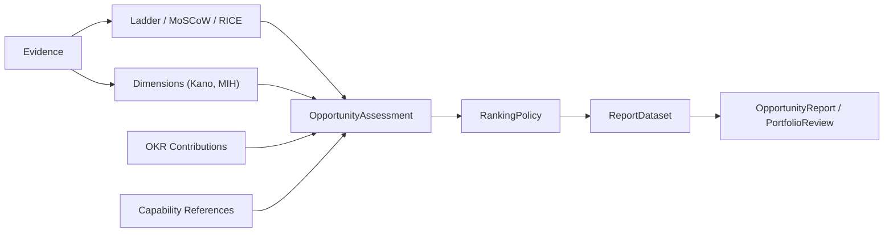

# Opportunity Prioritization (Assessment IR)

The `assessment` package (`github.com/grokify/prism-roadmap/assessment`) is an evidence-backed, rubric-driven prioritization record: a judge answers bounded Y/N rubric questions with cited evidence, and deterministic Go code — never the judge — turns those answers into a MoSCoW tier, a RICE score, a portfolio classification, and a final rank.

!!! note "Not the same type as the Opportunity Assessment canvas"
    This package's `OpportunityAssessment` is unrelated to `canvas.OpportunityAssessment`, the [SVPG 10-question canvas](../canvas/opportunity-assessment.md) — they're different Go types in different packages that happen to share a common English name. The canvas is a single-shot, human-authored go/no-go worksheet. This package is a regenerable, per-cycle, evidence-backed judgment record that feeds a ranked portfolio and generated reports.

## Design principle: the judge never invents a number

Every score, tier, or category in this package is *resolved* from evidence-backed answers by deterministic code — an LLM/judge only ever produces bounded Y/N answers with citations (`ThresholdAnswer`, `DimensionAnswer`). This is enforced structurally, not by convention: a `Satisfied: true` answer with no `EvidenceIDs` is treated as unsupported and ignored by every resolver in the package.

## Pipeline



## Evidence

`Evidence` wraps [structured-evaluation](https://github.com/plexusone/structured-evaluation)'s `claims.Claim` rather than reinventing claim/verdict semantics, adding capture metadata (source system, excerpt, capture time, sensitivity):

```go
import "github.com/grokify/prism-roadmap/assessment"

ev := assessment.NewEvidence("EV-042", "Deployment inventory shows 72% of accounts on the affected code path").
    WithSource("https://wiki.example.com/deploy-inventory", assessment.EvidenceSystemWiki, claims.SourceInternal, claims.ReliabilityHigh).
    WithExcerpt("72% of active accounts are on v3, the affected code path").
    WithCapturedAt(time.Now()).
    WithSensitivity(assessment.SensitivityInternal)
```

- `Sensitivity` (`SensitivityPublic`/`Internal`/`Restricted`) gates whether `RenderableExcerpt()` returns the quoted text or tells a renderer to cite the evidence ID with an access note instead. The zero value is **not** renderable — evidence with no sensitivity set is treated conservatively.
- `IsStale(now, window)` flags evidence older than `DefaultValidityWindow(system)` (90 days for analytics dashboards, 180 for docs/code/tickets, never for signed contracts).
- `EvidenceIndex` answers "which assessments/questions cite this evidence" over a flat `[]EvidenceRef` — a query helper, not a store; the persistence layer (omniroadmap) owns storage.

## Ladder: the shared threshold primitive

`Ladder` is a top-down, evidence-required threshold classifier shared by MoSCoW, RICE Impact, and RICE Confidence: an ordered list of `ThresholdLevel`s, each with citable criteria. `Evaluate` scans top-down and returns the first level whose answer is both `Satisfied` and evidence-backed — the same discipline used everywhere in this package, so a "yes" with no citation never counts.

```go
ladder := assessment.MoSCoWLadder()
level, answer, ok := ladder.Evaluate(answers)
```

## MoSCoW and RICE: resolved, not assigned

The existing [`prioritization`](../canvas/prioritization.md) package's `MoSCoWPriority`/`ImpactLevel`/`ConfidenceLevel` types are **reused, not redefined** — this package only changes how a value gets assigned to them:

| | `prioritization` package | `assessment` package |
|---|---|---|
| Input | Direct self-reported assignment on `OpportunitySpec`/`rmi.RoadmapItem` | Ladder threshold answers, each requiring cited evidence |
| Output | Same `MoSCoWPriority`/`ImpactLevel`/`ConfidenceLevel` types | Same `MoSCoWPriority`/`ImpactLevel`/`ConfidenceLevel` types |
| Use case | Quick triage, PM judgment call | Defensible, auditable prioritization for a portfolio review |

```go
tier := assessment.ResolveMoSCoWPriority(a.MoSCoWAnswers) // prioritization.MoSCoWPriority

result := assessment.ComputeRICE(assessment.RICEAssessment{
    Reach:  assessment.Reach{Fraction: 0.72, Population: "active paying accounts", EvidenceIDs: []string{"EV-042"}},
    ImpactAnswers:     impactAnswers,
    ConfidenceAnswers: confidenceAnswers,
    Effort: assessment.EffortEstimate{Expected: 12.0, Gate: assessment.EstimabilityGate{ /* ... */ }},
})
// result.Computable is false — with result.Reason explaining why — rather than
// a fabricated score, whenever evidence, an unresolved ladder level, or a
// failed EstimabilityGate makes the score untrustworthy.
```

`EffortEstimate.Gate` (`EstimabilityGate`) is a five-check estimability gate — scope, implementation, dependencies, testing, and deployment identified — that must pass before an effort estimate is trusted for RICE, so an under-specified plan comes back as "needs more detail" instead of a fabricated Person-Days number.

MoSCoW's "Won't/Not Now" tier and RICE's low end are the ladder's *floor*, not a rung with its own criteria — they're what you get when nothing else is satisfied with evidence, not something a judge tests for directly.

## Portfolio dimensions: Kano and Market Investment Horizon

`DimensionDefinition` is a versioned, referenceable portfolio dimension — either `DimensionKindCategory` (mutually exclusive, 0..1 selection) or `DimensionKindTags` (multi-select). Assessments reference a dimension by ID+version (`DimensionAssignment`), so a definition changing later never retroactively reinterprets a past assignment. **Dimensions are descriptive only — they never enter `RankingPolicy.Rank`.**

Two dimensions ship built in:

- **Kano** (`KanoDimension()`, `ResolveKano`) — Must-be, Performance, Attractive, Indifferent, Reverse. Resolved by a bespoke pattern-matcher over eight cross-cutting characterization questions (`KanoAnswers`), not the generic per-option resolver — Kano's categories aren't independent criteria the way a Ladder's levels are.
- **Market Investment Horizon** (`MarketInvestmentHorizonDimension()`) — KTLO / SAM+SOM / TAM Expansion, this project's own framework (not a published external standard) combining KTLO with TAM/SAM/SOM. Each category has its own independent criterion, so it resolves through the generic `DimensionDefinition.ResolveCategory`.

A custom, organization-defined dimension (e.g. a "2026 Strategic Priority" category) uses the exact same `DimensionDefinition` shape — no schema change needed to add one.

## OKR and capability links

`OKRContribution` links an opportunity to an objective (and optionally a specific key result) from the [`goals/okr`](../goals/okr.md) package, with an evidence-backed `ContributionStrength` (`high`/`medium`/`low`). `CapabilityReference` is a type alias for `prism-core`'s `CapabilityRef` (`enables`/`improves`/`dependsOn`), letting an opportunity reference a [prism-capability](https://github.com/grokify/prism-capability) capability without a hard dependency on its full domain model.

Neither is a `RankingPolicy` input — OKR alignment answers "what are we trying to achieve," not "which investment is best toward it"; folding it into the ranking formula would double-count against RICE/MoSCoW. What they do enable: a Person-Day investment rollup by objective or capability (see [Report Contracts](reports.md)), and — once opportunities ship — comparing predicted outcome against actual.

## OpportunityAssessment

`OpportunityAssessment` ties everything above into one per-cycle judgment record:

```go
type OpportunityAssessment struct {
    ID          string
    Opportunity OpportunityRef          // references a canvas.OpportunitySpec by ID
    Title       string
    Judge       *rubric.JudgeMetadata   // structured-evaluation judge provenance
    Cycle       AssessmentCycle

    MoSCoWAnswers []ThresholdAnswer
    RICE          *RICEAssessment
    Dimensions    []DimensionAssignment
    Contributions []OKRContribution
    Capabilities  []CapabilityReference
}
```

Resolved values (`MoSCoW()`, `ComputeRICE(*a.RICE)`) are always computed on demand from the raw answers — never stored redundantly, so a resolved value can never drift out of sync with the evidence behind it.

An assessment is never edited in place. A correction is a new cycle:

```go
first := assessment.NewOpportunityAssessment("OA-018", ref, "Self-service SSO", assessedAt)
// ... first cycle's judge run fills in MoSCoWAnswers, RICE, Dimensions ...

next := first.NextCycle("OA-019", laterTime) // carries Opportunity/Title forward, sets SupersedesID
first.MarkSuperseded()                        // caller persists both records
```

`HasEvidence()`, `HasRubricAnswers()`, and `EvidenceReferences()` walk every answer/citation on an assessment — used to decide whether a report's evidence/rubric appendices have anything to show, and to build an `EvidenceIndex` across a whole assessment corpus.

## Ranking

`RankingPolicy.Rank` is the deterministic ranking algorithm: **MoSCoW tier first, RICE score descending within tier.** Kano, Market Investment Horizon, and OKR/capability links never enter it — they describe portfolio composition and inform a human tie-break, never automatic rank.

```go
inputs := []assessment.RankInput{a1.ToRankInput(), a2.ToRankInput(), a3.ToRankInput()}
ranked := assessment.DefaultRankingPolicy().Rank(inputs) // MoSCoW tier, RICE desc, ±5% tie band
```

Opportunities that resolve to `MoSCoWWontHave`/unspecified, or whose RICE isn't computable, are **excluded with a reason** (`ExclusionWont`/`ExclusionRICEUncomputable`) rather than silently sorted to the bottom with a fabricated score — every input the policy is given comes back out, ranked or excluded, never dropped.

`RankOverride` records an explicit governance decision to move an opportunity away from its `CalculatedRank` — a new, auditable record, never a quiet reweighting of the RICE/MoSCoW inputs to manufacture a desired number:

```go
final := assessment.ApplyOverrides(ranked, []assessment.RankOverride{
    {AssessmentID: "OA-018", FinalRank: 2, Rationale: "contractual SLA commitment", ApprovedBy: "vp-product"},
})
collisions := assessment.RankCollisions(final) // FinalRank values shared by more than one opportunity — reconcile before presenting
```

`OpportunityRank` (`RankedOpportunity` + `FinalRank` + optional `Override`) is what a report or portfolio review shows: calculated rank next to final rank, so a reviewer can always see when and why they diverge.

## JSON Schema

`OpportunityAssessment`, `Evidence`, `DimensionDefinition`, and `OpportunityRank` are all available as generated JSON Schema via `github.com/grokify/prism-roadmap/schema` (`schema.OpportunityAssessmentSchema()`, etc.), matching this repo's existing PRD schema generation pattern.

## Next Steps

- [Report Contracts](reports.md) — turning a ranked portfolio into a report
- [Feature Prioritization](../canvas/prioritization.md) — the underlying RICE/Kano/MoSCoW types this package resolves into
- [Opportunity Assessment (SVPG canvas)](../canvas/opportunity-assessment.md) — the unrelated, same-named canvas type
