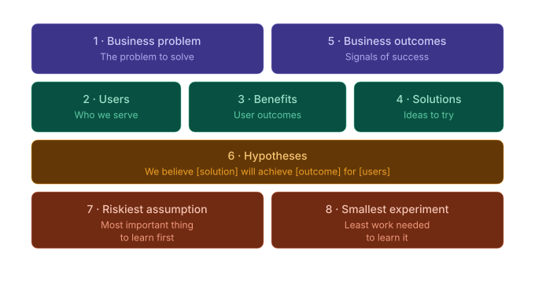

# Lean UX Canvas

The Lean UX Canvas follows Jeff Gothelf's v2 framework for hypothesis-driven product design.

## Overview

The Lean UX Canvas connects business problems to user outcomes through testable hypotheses and experiments.

## Grid Layout

| Business Problem | Business Outcomes ||
|------------------|-------------------|---|
| **Users** | **User Outcomes** | **Solutions** |
| **Hypotheses** | **Riskiest Assumption** | **Experiment** |

## Structure



### Example with Content


## Data Model

```go
type LeanUXCanvas struct {
    Metadata           Metadata

    // Top row
    BusinessProblem    string
    BusinessOutcomes   []Outcome

    // Middle row
    Users              []User
    UserOutcomes       []Outcome
    Solutions          []Solution

    // Bottom row
    Hypotheses         []Hypothesis
    RiskiestAssumption string
    Experiment         *Experiment
}

type Hypothesis struct {
    ID           string
    WeBelieve    string  // "We believe that..."
    WillResultIn string  // "...will result in..."
    WeWillKnow   string  // "We will know we're right when..."
    Validated    *bool
}

type Experiment struct {
    ID              string
    Description     string
    Method          string  // prototype, A/B test, survey, interview
    Duration        string
    SuccessCriteria string
    Results         string
    Status          string  // planned, running, completed
}
```

## Hypothesis Format

Lean UX uses a structured hypothesis format:

> **We believe that** [doing this / building this feature]
> **for** [these users]
> **will achieve** [this outcome].
> **We will know we're right when** [we see this metric change].

## Example

```go
lux := canvas.NewLeanUXCanvas("lux-onboarding", "Onboarding Redesign")

lux.BusinessProblem = "Low conversion from trial to paid"
lux.BusinessOutcomes = []canvas.Outcome{
    {ID: "bo1", Description: "Increase trial-to-paid conversion", Target: "15%"},
}

lux.Users = []canvas.User{
    {ID: "u1", Name: "New Trial Users"},
}

lux.UserOutcomes = []canvas.Outcome{
    {ID: "uo1", Description: "Understand core value in first session"},
}

lux.Solutions = []canvas.Solution{
    {ID: "s1", Description: "Personalized onboarding flow"},
}

lux.Hypotheses = []canvas.Hypothesis{
    {
        ID:           "h1",
        WeBelieve:    "Personalized onboarding based on user role",
        WillResultIn: "Higher completion rates",
        WeWillKnow:   "Onboarding completion increases by 25%",
    },
}

lux.RiskiestAssumption = "Users will provide their role during signup"

lux.Experiment = &canvas.Experiment{
    ID:              "e1",
    Description:     "Add role selection to signup flow",
    Method:          "A/B test",
    Duration:        "2 weeks",
    SuccessCriteria: "25% increase in onboarding completion",
    Status:          "planned",
}

// Render
c := canvas.NewLeanUX(lux)
d2Output, _ := render.Render(c, render.FormatD2, render.LeanUXOptions())
```

## Experiment Methods

| Method | Use Case |
|--------|----------|
| `prototype` | Test concepts before building |
| `A/B test` | Compare variations with real users |
| `survey` | Gather quantitative feedback |
| `interview` | Deep qualitative insights |
| `usability test` | Observe users with prototype |

## Examples

See `examples/canvas/leanux/` for complete examples.
