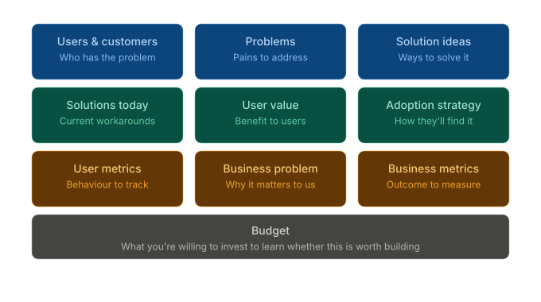

# Opportunity Canvas

The Opportunity Canvas follows Jeff Patton's 9-block structure for evaluating product opportunities before committing resources.

## Overview

The canvas supports two view modes:

| View | Options | Description |
|------|---------|-------------|
| **Grid** | `OpportunityGridOptions()` | BMC-style 3x3+1 layout (no arrows) |
| **Flow** | `OpportunityOptions()` | Arrow-based flow showing relationships |

## Grid Layout (Patton's 9-Block)

### Structure



### Example with Content


The grid view organizes information in a structured format without directional arrows:

| Row | Column 1 | Column 2 | Column 3 |
|-----|----------|----------|----------|
| **1** | Users & Customers | Problems | Solution Ideas |
| **2** | Solutions Today | User Value | Adoption Strategy |
| **3** | User Metrics | Business Problem | Business Metrics |
| **4** | Budget (spans 3 columns) |||

### Grid Fields

```go
type OpportunityCanvas struct {
    // Row 1: Problem Space
    Users            []User     // Who has the problem
    Problems         []Problem  // Pains to address
    SolutionIdeas    []string   // Ways to solve it

    // Row 2: Solution Space
    CurrentSolutions []Solution // Current workarounds
    UserValue        []string   // Benefits to users
    AdoptionStrategy []string   // How they'll find it

    // Row 3: Metrics & Business
    UserMetrics      []string   // Behaviour to track
    BusinessProblem  string     // Why it matters to us
    BusinessMetrics  []string   // Outcome to measure

    // Row 4: Budget (full width)
    Budget           *Budget    // Investment to learn
}
```

### Grid Example

```go
opp := canvas.NewOpportunityCanvas("opp-mobile", "Mobile App Opportunity")

// Row 1
opp.Users = []canvas.User{
    {ID: "u1", Name: "Team Managers"},
    {ID: "u2", Name: "Executives"},
}
opp.Problems = []canvas.Problem{
    {ID: "p1", Description: "Desktop-only access"},
}
opp.SolutionIdeas = []string{"Native app", "PWA", "Responsive web"}

// Row 2
opp.CurrentSolutions = []canvas.Solution{
    {ID: "s1", Name: "Email notifications"},
}
opp.UserValue = []string{"Access anywhere", "Faster response"}
opp.AdoptionStrategy = []string{"In-app prompts", "QR codes"}

// Row 3
opp.UserMetrics = []string{"Mobile DAU", "Time to action"}
opp.BusinessProblem = "Losing customers to mobile-first competitors"
opp.BusinessMetrics = []string{"Retention rate", "Mobile revenue"}

// Row 4
opp.Budget = &canvas.Budget{
    TimeEstimate: "6 months",
    TeamSize:     "4 engineers, 1 designer",
    CostEstimate: "$800K",
}

// Render as grid
gridD2, _ := render.Render(
    canvas.NewOpportunity(opp),
    render.FormatD2,
    render.OpportunityGridOptions(),
)
```

### D2 Grid Output

```d2
grid-rows: 4
grid-columns: 3

users: {
  label: "Users & Customers\nWho has the problem"
  style.fill: "#E3F2FD"
  u1: "Team Managers"
  u2: "Executives"
}

problems: {
  label: "Problems\nPains to address"
  style.fill: "#FFEBEE"
  p1: "Desktop-only access"
}

# ... other blocks ...

budget: {
  grid-column-span: 3
  label: "Budget\nWhat you're willing to invest to learn"
  style.fill: "#FFFDE7"
  details: "Time: 6 months | Team: 4 engineers | Cost: $800K"
}
```

## Flow View (Arrow-Based)

The flow view shows relationships between elements with directional arrows:

```
Problems ──→ Value Proposition ──→ User Value ──→ Validation
   ↑                    │
Users                   └──→ Business Value ──→ Risks
```

### Flow Fields

The flow view uses legacy fields for backward compatibility:

```go
type OpportunityCanvas struct {
    // Problem Space
    Problems         []Problem
    Users            []User
    CurrentSolutions []Solution

    // Solution Space
    ValueProposition ValueProp
    UserValue        []string
    BusinessValue    []string

    // Validation
    Assumptions      []Assumption
    Risks            []Risk
    Budget           *Budget
}
```

### Flow Example

```go
opp := canvas.NewOpportunityCanvas("opp-mobile", "Mobile App")
opp.ValueProposition = canvas.ValueProp{
    Statement:      "Native mobile app for on-the-go access",
    Differentiator: "Offline-first with intelligent sync",
}
opp.Assumptions = []canvas.Assumption{
    {ID: "a1", Description: "Users will adopt within 30 days", Validated: true},
}
opp.Risks = []canvas.Risk{
    {ID: "r1", Description: "Development takes longer", Impact: "high"},
}

// Render as flow
flowD2, _ := render.Render(
    canvas.NewOpportunity(opp),
    render.FormatD2,
    render.OpportunityOptions(),  // flow view
)
```

## Color Scheme

### Grid View Colors

| Block | Color | Hex |
|-------|-------|-----|
| Users | Blue | `#E3F2FD` |
| Problems | Red | `#FFEBEE` |
| Solution Ideas | Green | `#E8F5E9` |
| Current Solutions | Orange | `#FFF3E0` |
| User Value | Green | `#E8F5E9` |
| Adoption Strategy | Purple | `#F3E5F5` |
| User Metrics | Blue | `#E3F2FD` |
| Business Problem | Red | `#FFEBEE` |
| Business Metrics | Green | `#E8F5E9` |
| Budget | Yellow | `#FFFDE7` |

## Format Support

| Feature | D2 | SVG | Mermaid | HTML |
|---------|----|----|---------|------|
| Grid layout | grid-rows/columns | Rendered | Subgraphs | CSS Grid |
| Column span | grid-column-span: 3 | Rendered | Not supported | grid-column: span 3 |
| Flow arrows | → connections | Rendered | --> syntax | Mermaid.js |
| Colors | style.fill | Rendered | style | CSS classes |

## JSON Schema

```json
{
  "type": "opportunity",
  "opportunity": {
    "metadata": {
      "id": "opp-mobile",
      "title": "Mobile App Opportunity",
      "version": "opportunity/1.0"
    },
    "users": [
      {"id": "u1", "name": "Team Managers"}
    ],
    "problems": [
      {"id": "p1", "description": "Desktop-only access", "severity": "high"}
    ],
    "solutionIdeas": ["Native app", "PWA"],
    "currentSolutions": [
      {"id": "s1", "name": "Email notifications", "type": "workaround"}
    ],
    "userValue": ["Access anywhere"],
    "adoptionStrategy": ["In-app prompts"],
    "userMetrics": ["Mobile DAU"],
    "businessProblem": "Losing to mobile-first competitors",
    "businessMetrics": ["Retention rate"],
    "budget": {
      "timeEstimate": "6 months",
      "costEstimate": "$800K"
    }
  }
}
```

## CLI Usage

```bash
# Generate grid view
splan canvas opportunity render input.json --view=grid -o output_grid.d2

# Generate flow view
splan canvas opportunity render input.json --view=flow -o output_flow.d2

# Generate SVG (requires d2 CLI)
d2 output_grid.d2 output_grid.svg
```

## Examples

See `examples/canvas/opportunity/` for complete examples:

- `opportunity_example.json` - Source data
- `opportunity_grid_example.d2` - Grid view D2
- `opportunity_grid_example.svg` - Grid view SVG
- `opportunity_flow_example.d2` - Flow view D2
- `opportunity_flow_example.svg` - Flow view SVG
