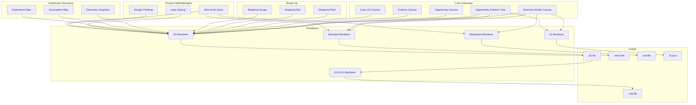
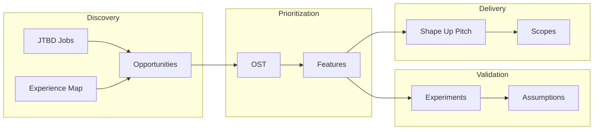

# Strategic Planning Canvases

Visual canvas frameworks for strategic planning and opportunity assessment. Each canvas type provides a structured approach to problem-solving and decision-making.

## Canvas Types

### Core Canvases

| Canvas | Framework | Use Case |
|--------|-----------|----------|
| [Business Model Canvas](bmc.md) | Osterwalder | Business model visualization (9-block) |
| [Opportunity Solution Tree](ost.md) | Torres | Outcome-driven product discovery |
| [Opportunity Canvas](opportunity.md) | Patton | Opportunity assessment (grid & flow views) |
| [Opportunity Assessment](opportunity-assessment.md) | Cagan (SVPG) | 10-question go/no-go evaluation |
| [OpportunitySpec](opportunity-spec.md) | Patton + Cagan | Merged 12-box discovery + business case |
| [Feature Canvas](feature.md) | Efimov | Feature definition and validation |
| [Lean UX Canvas](leanux.md) | Gothelf | Hypothesis-driven product design |

### Shape Up (Basecamp)

| Canvas | Use Case |
|--------|----------|
| ShapeUp Pitch | Problem framing and appetite setting |
| ShapeUp Bet | Decision to commit resources |
| ShapeUp Scope | Scope hammering during build |

### Continuous Discovery (Torres)

| Canvas | Use Case |
|--------|----------|
| Discovery Snapshot | Weekly discovery progress |
| Assumption Map | Risk/evidence tracking |
| Experience Map | Customer journey analysis |

### Product Methodologies

| Canvas | Framework | Use Case |
|--------|-----------|----------|
| Lean Startup | Ries | Build-Measure-Learn experiments |
| Design Thinking | Stanford d.school | Empathize-Define-Ideate-Prototype-Test |
| Jobs-to-be-Done | Christensen/Ulwick | Job statements, outcomes, forces analysis |

## Output Formats

Each canvas supports multiple rendering formats:

| Format | Extension | Description |
|--------|-----------|-------------|
| D2 | `.d2` | D2 diagram language text |
| SVG | `.svg` | Rendered vector graphics (via D2 CLI) |
| Mermaid | `.mmd` | Mermaid diagram syntax |
| Lit JSON | `.lit.json` | Structured data for Lit web components |
| HTML | `.html` | Interactive HTML viewer |

## Quick Example

```go
import (
    "github.com/grokify/prism-roadmap/canvas"
    "github.com/grokify/prism-roadmap/canvas/render"
)

// Create an Opportunity Solution Tree
ost := canvas.NewOpportunitySolutionTree("ost-1", "User Onboarding")
ost.Outcome = canvas.OSTOutcome{
    ID:          "O1",
    Description: "Increase activation to 60%",
    Metric:      "% users completing onboarding",
    Target:      "60%",
}

// Wrap in Canvas container
c := canvas.NewOST(ost)

// Render to D2
d2Output, err := render.Render(c, render.FormatD2, render.OSTOptions())

// Render to Mermaid
mermaidOutput, err := render.Render(c, render.FormatMermaid, nil)
```

## Rendering Options

Each canvas type has optimized default options:

```go
// Core canvases
render.BMCOptions()              // 9-block grid layout
render.OSTOptions()              // Tree layout (top-down)
render.OpportunityOptions()      // Flow view with arrows
render.OpportunityGridOptions()  // BMC-style grid (no arrows)
render.FeatureOptions()          // Grid layout
render.LeanUXOptions()           // Grid layout

// Shape Up
render.ShapeUpPitchOptions()     // Pitch sections layout
render.ShapeUpBetOptions()       // Betting table layout
render.ShapeUpScopeOptions()     // Hill chart + scopes

// Continuous Discovery
render.DiscoverySnapshotOptions() // Weekly snapshot layout
render.AssumptionMapOptions()     // Risk/evidence quadrant
render.ExperienceMapOptions()     // Timeline journey layout

// Product Methodologies
render.LeanStartupOptions()      // Build-Measure-Learn cycle
render.DesignThinkingOptions()   // 5-phase diamond layout
render.JTBDOptions()             // Job map + forces layout
```

## Architecture



## Methodology Selection Guide

Choose the right framework based on your context:

### When to Use Each Framework

| Framework | Best For | Key Strength | Team Size |
|-----------|----------|--------------|-----------|
| **Shape Up** | Mature products, fixed teams | Time-boxed delivery (6 weeks) | Small (2-3) |
| **Continuous Discovery** | Ongoing products, dedicated PM | Weekly cadence, assumption testing | Any |
| **Lean Startup** | New ventures, high uncertainty | Build-Measure-Learn speed | Small |
| **Design Thinking** | Complex problems, user empathy | Divergent-convergent process | Cross-functional |
| **Jobs-to-be-Done** | Market research, positioning | Deep customer understanding | Research-focused |
| **Opportunity Solution Tree** | Feature prioritization | Outcome alignment | PM + team |
| **Business Model Canvas** | Business strategy | Holistic view | Leadership |

### Decision Flowchart

```
Start
  │
  ├─ Is this a new product/venture?
  │   ├─ Yes → Lean Startup + JTBD
  │   └─ No → Continue
  │
  ├─ Do you have dedicated discovery time?
  │   ├─ Yes (≥4 hrs/week) → Continuous Discovery
  │   └─ No → Shape Up (pitches contain discovery)
  │
  ├─ Is the problem space unclear?
  │   ├─ Yes → Design Thinking + Experience Map
  │   └─ No → Continue
  │
  ├─ Do you need to prioritize opportunities?
  │   ├─ Yes → OST + Opportunity Canvas
  │   └─ No → Continue
  │
  └─ Ready to build?
      ├─ Shape Up → Pitch → Bet → Build (Scope)
      └─ Traditional → Feature Canvas → PRD
```

### Framework Combinations

Frameworks are designed to work together. Common combinations:

| Combination | Flow | Use Case |
|-------------|------|----------|
| JTBD → OST → Shape Up | Research → Prioritize → Deliver | Full product cycle |
| Design Thinking → Lean Startup | Problem → Solution validation | New product discovery |
| Continuous Discovery + Shape Up | Parallel | Ongoing discovery + delivery |
| BMC + Opportunity Assessment | Strategy → Go/No-Go | Investment decisions |
| Experience Map → Feature Canvas | Journey → Feature spec | UX-driven development |

### Integration Points

Each methodology connects through shared concepts:



## PRD Integration

Canvases can link back to PRD elements:

```go
opp := canvas.NewOpportunityCanvas("opp-1", "Mobile App")
opp.PRDRef = &canvas.PRDReference{
    PRDID:          "prd-mobile-app",
    FeatureIDs:     []string{"f-mobile-auth", "f-mobile-dashboard"},
    RequirementIDs: []string{"FR-001", "FR-002"},
    PersonaIDs:     []string{"persona-manager", "persona-exec"},
}
```

## Examples

See `examples/canvas/` for complete examples:

```bash
examples/canvas/
├── bmc/
│   ├── bmc_example.json
│   ├── bmc_example.d2
│   ├── bmc_example.svg
│   └── bmc_example.html
├── ost/
├── opportunity/
│   ├── opportunity_example.json
│   ├── opportunity_grid_example.d2   # BMC-style grid
│   ├── opportunity_flow_example.d2   # Arrow-based flow
│   └── ...
├── feature/
├── leanux/
├── shapeup/
│   ├── pitch_example.json
│   ├── bet_example.json
│   └── scope_example.json
├── discovery/
│   ├── snapshot_example.json
│   ├── assumption_map_example.json
│   └── experience_map_example.json
├── leanstartup/
│   └── leanstartup_example.json
├── designthinking/
│   └── designthinking_example.json
└── jtbd/
    └── jtbd_example.json
```
